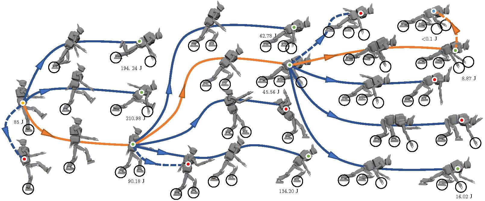

# Unified Multi-Contact Fall Mitigation Planning for Humanoids via Contact Transition Tree Optimization
IEEE Int'l. Conf. on Humanoid Robots (Humanoids), 2018, **Best Paper Award nominee**  
Source code for [paper](https://arxiv.org/abs/1807.08667)

## Abstract
This package contributes a multi-contact approach to generalized humanoid fall mitigation planning that unifies inertial shaping, protective stepping, and hand contact strategies. The implemented planner automatically optimizes both the **high-level** contact sequence and the **low-level** trajectories of _robot state_, _contact force_ and _control torque_. Given _a robot urdf file_, _initial disturbed robot state_ and _a user-defined 3D envirvonment_, the proposed algorithm calculates the multi-contact fall mitigation behavior of the robot to achieve a final stabilization.



## Installation
Installation has been tested on a fresh install of Ubuntu 14.04 with Python 2.7.

### Dependencies
Package compilation requres:
* [Klampt](https://github.com/krishauser/Klampt): An open-source, cross-platform software package for robot modeling, simulating, planning, optimization, and visualization.
* [trajOptLib](https://gitlab.oit.duke.edu/gt70/trajOptLib) : A library for trajectory optimization using direct transcription approach. (This package replies on [SNOPT](https://github.com/snopt) and [IPOPT](https://github.com/coin-or/Ipopt) and please have at least one of these two solvers ready to use this package.)
  
>You need to follow the installation instruction of these two dependecies to make use of this _contact transition tree optimization_ package.  

After installation of these two dependencies, you just need to clone this repository to your local disk to finish the installation.

```
git clone https://github.com/ShihaoWang/Contact-Transition-Tree
cd Contact\ Transition\ Tree/
```

## Instructions
This package supports any humanoid robot and reads in any environment customized by the user to satisfy the need to real-world humanoid fall mitigation. Since this package replies on [Klampt](https://github.com/krishauser/Klampt) for operations on robot, a Klampt preferred URDF format has to be changed accordingly to enable the robot feature identification. A Klampt URDF tutorial can be found [here](https://github.com/krishauser/Klampt/blob/master/Documentation/Tutorials/Import-and-calibrate-urdf.md). 

### Import Robot

Within this package, there is a **User_File** folder which saves the robot information and the initial disturbed robot state for stabilization. To import your own robot, you need to create a new folder inside **User_File** and have the following files ready:
* **Init_Config.txt**: a column double list describing the initial configuration of the robot
* **Init_Velocity.txt**: a column double list describing the initial velocity of the robot
* **Contact_Link.txt**: a file describing the contact information of the robot. The index number of the link to make contact and the local coordinates of the contact extremities on this link have to be provided to enable the generation of multi-contact fall mitigation behavior. A strict format is required in this file. Here is an example:
```
Link17
0.13, 0.075, -0.105
0.13, -0.055, -0.105
-0.1, -0.055, -0.105
-0.1, 0.075, -0.105
Link11
0.13, 0.055, -0.105
0.13, -0.075, -0.105
```
After _contact header_ "Link" + "(Index Number)", the desired local coordinates are written down to declare the contact points. It is desired that these local contact points are on the same plane of the contact link and the local contact sequence is written down in a clockwise or counter-clockwise order.

**How to figure out the link number?**  
You need to use Klampt's RobotPose or RobotTest apps to figure out the corresponding index number of certain robot links.

**How to figure out the local coordinates of contact extremities?**  
This procedure can be conducted with the help of some CAD softwares such as Solidworks, MeshLab, and AutoCAD.
* **Init_Contact.txt**: a file describing the contact status at the initial robot state. **1** denotes a contact point is active while **0** denotes a contact point is inactive. 

Two supplemental robot files have already been provided for your information on how to import robot.

### Customize Environment

The customization of experiment environment is conducted with edition of the Klampt XML files. The general format is shown as follows.
```
<?xml version="1.0" encoding="UTF-8"?>
<world>
  <!-- <robot name="JQrobot" file="path to robot/JQRobot.rob"/> -->
  <robot name="HRP2robot" file="path to robot/hrp2.rob"/>
  <terrain file="path to Klampt/Klampt/data/terrains/plane.off" scale = "0.5 0.5 0.5" translation= "0.0 0.0 0.0"/>
  <terrain file="path to Klampt/Klampt/data/terrains/cube.off" scale="1 1 2" translation="2.5 -0.5 0.0">
     <display color="0.4 0.3 0.2"/>
  </terrain>
  <!-- <terrain file="path to Klampt/Klampt/data/terrains/cube.off" scale="1 1 1" translation="0 0.0 0.0" rotateZ = "0"/> -->
  <target position="-0.5 0 0.2" />
  <simulation>
     <object index="0">
       <geometry padding="0.005" />
     </object>
     <globals adaptiveTimeStepping="0"/>
  </simulation>
</world>
```
This XML files defines the shape and position of environment features including grounds and other nearby obstacles and initializes the staring position of the robot with respect to the environment obstacles. You can check out many XML files provided in the Klampt/data folder to learn more about XML file edition and play with objects in Klampt/data/objects folder to import environment object to the simulation environment.

### Optimization parameters

This package operates with an optimization method and there are 4 parameters which can be tuned by the user.
1. Grids_Number in **Main.py**: this parameter determines the number of grid points along the trajectory optimization and an increment of this value leads to an even finer optimization solution at the expense of computational time.
2. Duration_min in **CTT_Fun.py**: a lower bound on the time duration for the robot motion during a certain contact mode.
3. Duration_max in **CTT_Fun.py**: an upper bound on the time duration for the robot motion during a certain contact mode.
4. Duration_Grids_number in **CTT_Fun.py**: number of times tried in the seed initialization step. A small value can lead to the missing of the optimized solution.


## Quick Start

To run this whole package, just direct to this path folder and type the following command in the Terminal
```
python Main.py Robot_Envi.xml
```

>Please remember to change the path to robot model in **Robot_Envi.xml** and **Robot_Option** parameter in the **Main.py** whenever there is a modification of the robot model.


Enjoy the contact transition tree optimization!

If you encounter any problems with the code, want to report bugs, etc. please contact me at shihao.wang[at]duke[dot]edu.


